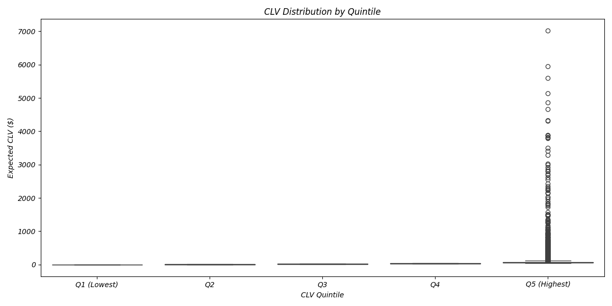
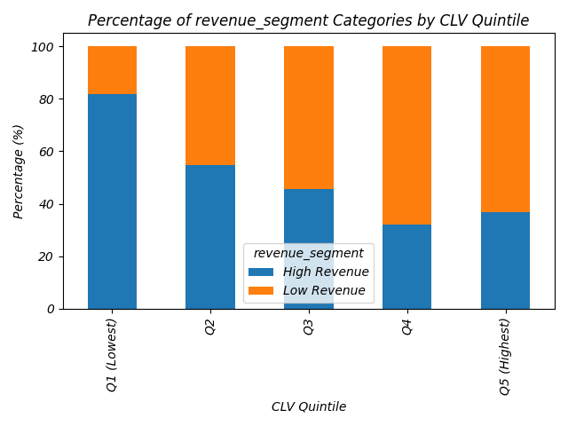
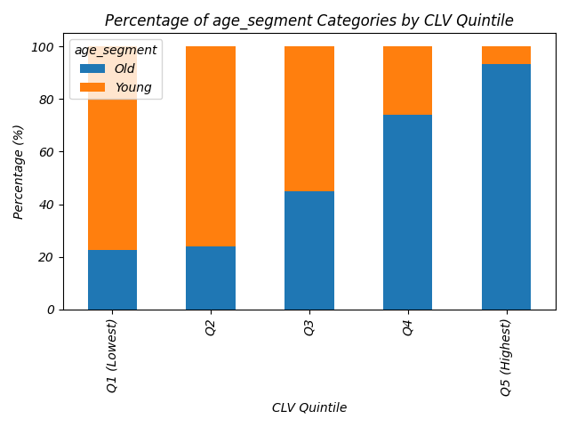
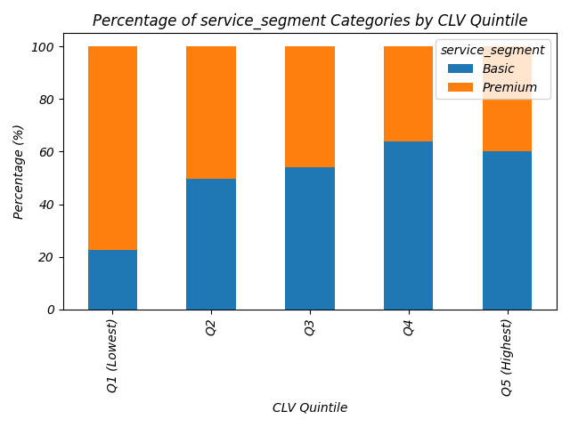
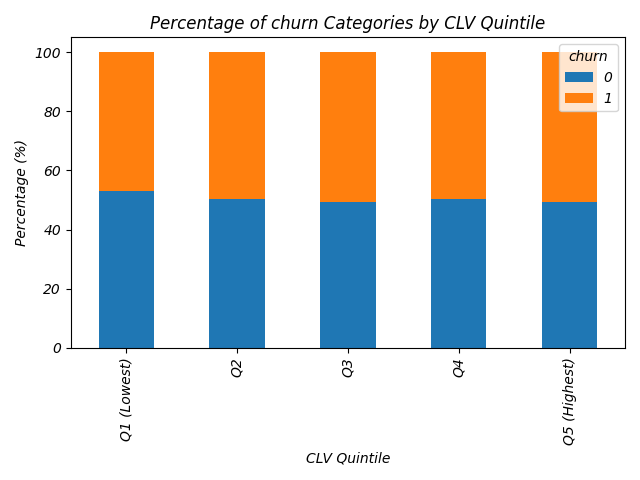
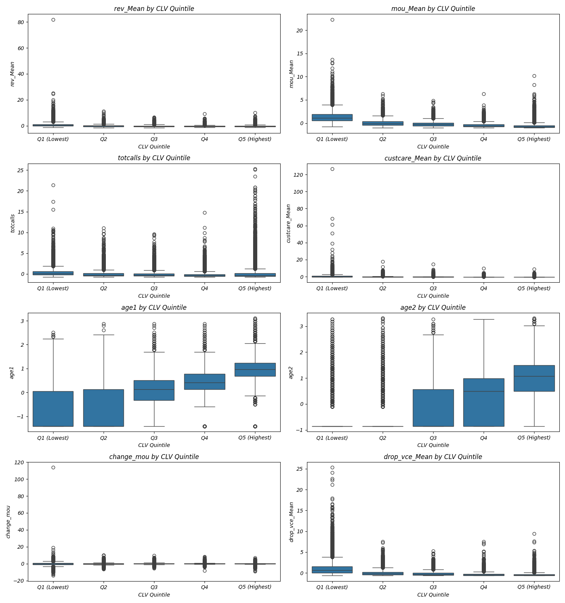

# Customer Segmentation by CLV Quintiles

## CLV Statistics by Quintile
| clv_quintile   |   count |      min |      mean |    median |        max |
|:---------------|--------:|---------:|----------:|----------:|-----------:|
| Q1 (Lowest)    |   20000 |  0       |  0.684906 |  0.365377 |    2.49407 |
| Q2             |   20000 |  2.49469 |  6.04108  |  5.89269  |   10.0594  |
| Q3             |   20000 | 10.0605  | 16.598    | 16.2229   |   24.4493  |
| Q4             |   20000 | 24.4525  | 33.6042   | 33.3363   |   44.2458  |
| Q5 (Highest)   |   20000 | 44.2461  | 85.3116   | 62.0575   | 7018.01    |

## Key Characteristics by Quintile

### Q4

- **CLV Range**: $24.45 to $44.25
- **Mean CLV**: $33.60
- **Median CLV**: $33.34
- **Number of Customers**: 20,000

**Segment Distribution:**

*revenue_segment*
- Low Revenue: 67.8%
- High Revenue: 32.2%

*age_segment*
- Old: 73.9%
- Young: 26.1%

*service_segment*
- Basic: 63.9%
- Premium: 36.0%

*churn*
- 0: 50.2%
- 1: 49.8%

**Key Metrics (median values):**

- rev_Mean: -0.48
- mou_Mean: -0.59
- totcalls: -0.42
- custcare_Mean: -0.34
- age1: 0.41
- age2: 0.49
- change_mou: 0.04
- drop_vce_Mean: -0.48

### Q5 (Highest)

- **CLV Range**: $44.25 to $7018.01
- **Mean CLV**: $85.31
- **Median CLV**: $62.06
- **Number of Customers**: 20,000

**Segment Distribution:**

*revenue_segment*
- Low Revenue: 63.3%
- High Revenue: 36.7%

*age_segment*
- Old: 93.2%
- Young: 6.8%

*service_segment*
- Basic: 60.0%
- Premium: 40.0%

*churn*
- 1: 50.7%
- 0: 49.3%

**Key Metrics (median values):**

- rev_Mean: -0.45
- mou_Mean: -0.74
- totcalls: -0.42
- custcare_Mean: -0.34
- age1: 0.96
- age2: 1.08
- change_mou: 0.04
- drop_vce_Mean: -0.55

### Q3

- **CLV Range**: $10.06 to $24.45
- **Mean CLV**: $16.60
- **Median CLV**: $16.22
- **Number of Customers**: 20,000

**Segment Distribution:**

*revenue_segment*
- Low Revenue: 54.3%
- High Revenue: 45.7%

*age_segment*
- Young: 55.2%
- Old: 44.8%

*service_segment*
- Basic: 54.0%
- Premium: 46.0%

*churn*
- 1: 50.5%
- 0: 49.5%

**Key Metrics (median values):**

- rev_Mean: -0.30
- mou_Mean: -0.32
- totcalls: -0.32
- custcare_Mean: -0.34
- age1: 0.14
- age2: -0.86
- change_mou: 0.03
- drop_vce_Mean: -0.33

### Q2

- **CLV Range**: $2.49 to $10.06
- **Mean CLV**: $6.04
- **Median CLV**: $5.89
- **Number of Customers**: 20,000

**Segment Distribution:**

*revenue_segment*
- High Revenue: 54.6%
- Low Revenue: 45.4%

*age_segment*
- Young: 76.2%
- Old: 23.8%

*service_segment*
- Premium: 50.4%
- Basic: 49.6%

*churn*
- 0: 50.3%
- 1: 49.7%

**Key Metrics (median values):**

- rev_Mean: -0.18
- mou_Mean: -0.11
- totcalls: -0.27
- custcare_Mean: -0.27
- age1: -1.42
- age2: -0.86
- change_mou: 0.01
- drop_vce_Mean: -0.22

### Q1 (Lowest)

- **CLV Range**: $0.00 to $2.49
- **Mean CLV**: $0.68
- **Median CLV**: $0.37
- **Number of Customers**: 20,000

**Segment Distribution:**

*revenue_segment*
- High Revenue: 81.7%
- Low Revenue: 18.3%

*age_segment*
- Young: 77.5%
- Old: 22.5%

*service_segment*
- Premium: 77.5%
- Basic: 22.4%

*churn*
- 0: 52.9%
- 1: 47.1%

**Key Metrics (median values):**

- rev_Mean: 0.42
- mou_Mean: 1.09
- totcalls: 0.06
- custcare_Mean: 0.10
- age1: -1.42
- age2: -0.86
- change_mou: -0.12
- drop_vce_Mean: 0.60

## Visualizations

### CLV Distribution by Quintile

### revenue_segment Distribution by Quintile

### age_segment Distribution by Quintile

### service_segment Distribution by Quintile

### churn Distribution by Quintile

### Numerical Features by Quintile

## Business Recommendations by Quintile

### Q5 (Highest CLV)
- **Strategy**: Loyalty and retention focus
- **Actions**: Premium service offerings, personalized engagement, loyalty rewards
- **Goal**: Maintain long-term relationship and maximize share of wallet

### Q4
- **Strategy**: Growth and cross-selling
- **Actions**: Targeted upgrade offers, premium service trials, expanded engagement
- **Goal**: Increase usage and move customers to highest CLV segment

### Q3
- **Strategy**: Engagement and value enhancement
- **Actions**: Usage incentives, feature education, mid-tier offerings
- **Goal**: Increase product usage and customer engagement

### Q2
- **Strategy**: Service improvement and satisfaction
- **Actions**: Satisfaction surveys, service quality improvements, targeted offers
- **Goal**: Address pain points and improve retention

### Q1 (Lowest CLV)
- **Strategy**: Cost-effective management and selective retention
- **Actions**: Digital self-service options, basic service improvements, selective win-back campaigns
- **Goal**: Improve profitability and identify potential for upward migration

