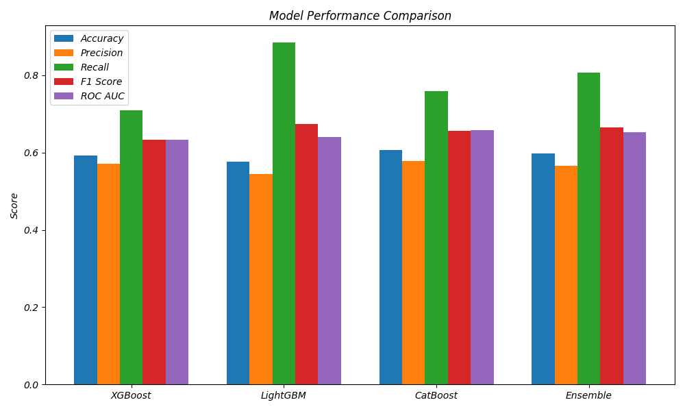

# Ensemble vs Individual Models Comparison

## Metrics Bar Plot

## ROC Curves

## Metrics Table
| Model | Accuracy | Precision | Recall | F1 Score | ROC AUC |
|-------|----------|-----------|--------|----------|---------|
| XGBoost | 0.5923 | 0.5714 | 0.7093 | 0.6330 | 0.6329 |
| LightGBM | 0.5758 | 0.5443 | 0.8844 | 0.6739 | 0.6404 |
| CatBoost | 0.6068 | 0.5786 | 0.7599 | 0.6570 | 0.6575 |
| Ensemble | 0.5985 | 0.5666 | 0.8073 | 0.6659 | 0.6530 |
