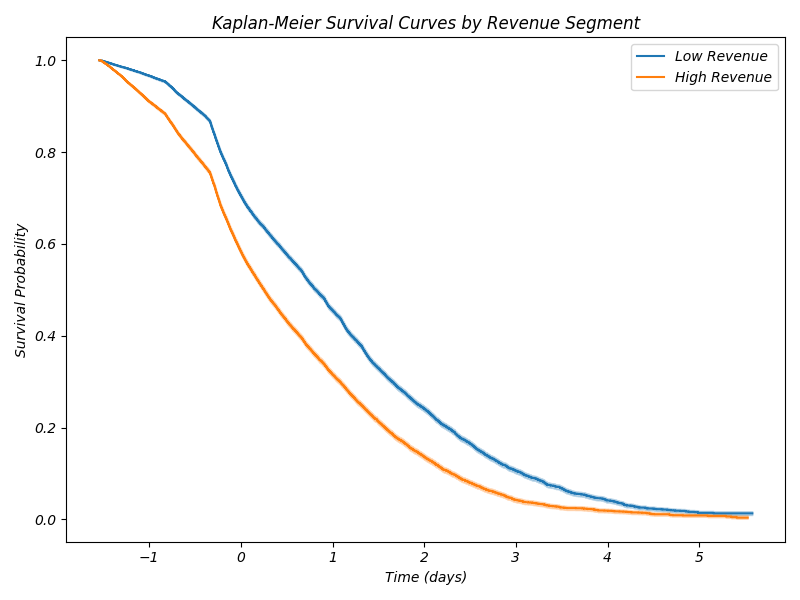
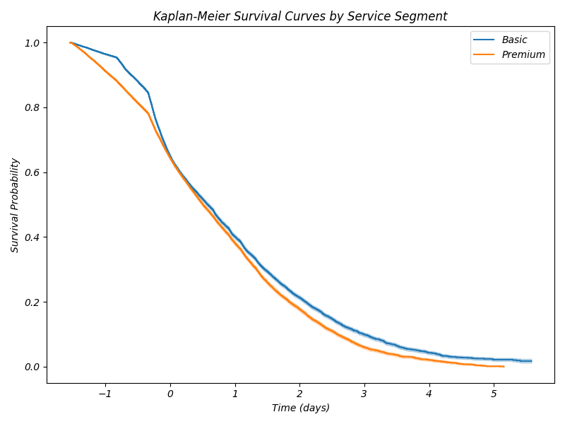
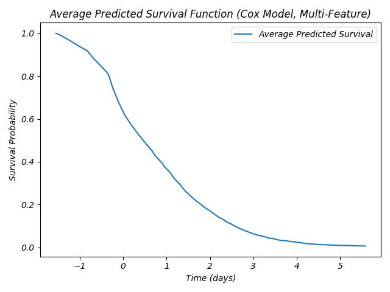

# Refined Survival Analysis Report

## Kaplan-Meier Survival Curves by Revenue Segment


## Kaplan-Meier Survival Curves by Age Segment


## Kaplan-Meier Survival Curves by Service Segment


## Cox Proportional Hazards Model Summary (Multi-Feature)
```
                   coef  exp(coef)  se(coef)  coef lower 95%  ...  cmp to          z              p    -log2(p)
covariate                                                     ...                                              
rev_Mean       0.010544   1.010599  0.005443       -0.000125  ...     0.0   1.937025   5.274223e-02    4.244898
mou_Mean       0.313954   1.368826  0.007406        0.299439  ...     0.0  42.393961   0.000000e+00         inf
totcalls      -0.167092   0.846121  0.007058       -0.180926  ...     0.0 -23.673862  6.704188e-124  409.174021
custcare_Mean  0.022984   1.023250  0.002461        0.018160  ...     0.0   9.339047   9.720462e-21   66.479465
age1          -0.127345   0.880430  0.006096       -0.139293  ...     0.0 -20.889402   6.685079e-97  319.486081
age2          -0.025945   0.974388  0.006100       -0.037901  ...     0.0  -4.253513   2.104426e-05   15.536213
change_mou    -0.036379   0.964275  0.004426       -0.045053  ...     0.0  -8.219918   2.036420e-16   52.124814
drop_vce_Mean  0.090414   1.094627  0.004895        0.080819  ...     0.0  18.469125   3.659649e-76  250.594830

[8 rows x 11 columns]
```
## Average Predicted Survival Function (Multi-Feature Cox Model)

