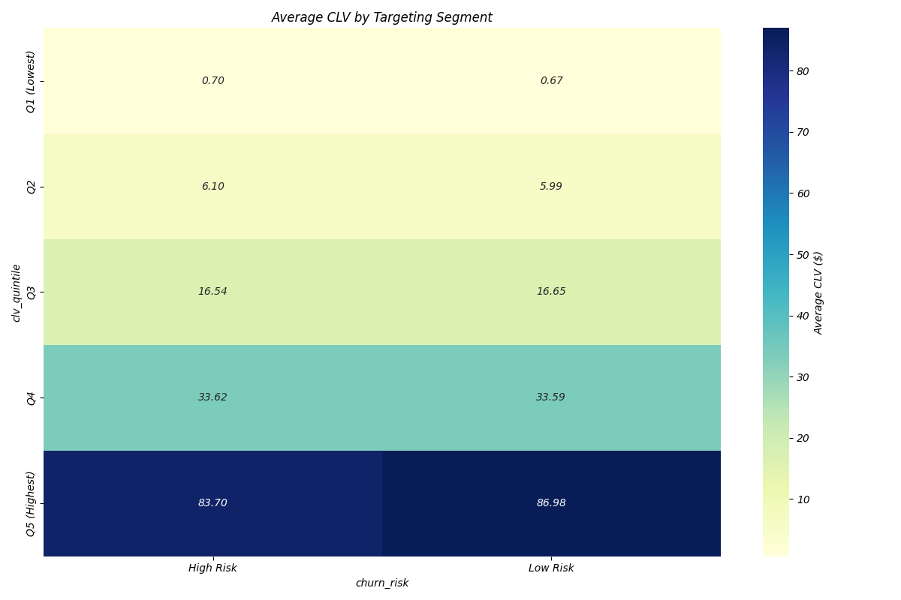

# Customer Targeting Matrix: CLV × Churn Risk

## Approach
This targeting matrix combines Customer Lifetime Value (CLV) quintiles with churn risk to create a strategic framework for customer targeting and retention efforts. The matrix allows for prioritization of resources based on both customer value and risk level.

## Customer Targeting Matrix

### Average CLV by Segment

### CLV Distribution by Segment

## Segment Statistics
| targeting_segment        |   CLV_Mean |   CLV_Median |   Count |   Churn_Rate |
|:-------------------------|-----------:|-------------:|--------:|-------------:|
| Q1 (Lowest) | High Risk  |   0.701539 |     0.387352 |    9412 |            1 |
| Q1 (Lowest) | Low Risk   |   0.670121 |     0.346643 |   10588 |            0 |
| Q2 | High Risk           |   6.09605  |     5.98332  |    9937 |            1 |
| Q2 | Low Risk            |   5.98679  |     5.81011  |   10063 |            0 |
| Q3 | High Risk           |  16.5434   |    16.1548   |   10106 |            1 |
| Q3 | Low Risk            |  16.6538   |    16.2932   |    9894 |            0 |
| Q4 | High Risk           |  33.6153   |    33.3602   |    9958 |            1 |
| Q4 | Low Risk            |  33.5932   |    33.31     |   10042 |            0 |
| Q5 (Highest) | High Risk |  83.6953   |    62.1997   |   10149 |            1 |
| Q5 (Highest) | Low Risk  |  86.9767   |    61.9204   |    9851 |            0 |

## Strategic Recommendations by Segment

### Q5 (Highest) | High Risk
- **Priority**: ★★★★★ (Highest priority)
- **Strategy**: Proactive retention and service recovery
- **Actions**: 
  - Immediate outreach by dedicated account managers
  - Premium retention offers with high-value incentives
  - Personalized service quality improvements
  - Executive attention for service recovery if needed
- **Investment Level**: High - these customers represent the highest potential revenue loss

### Q5 (Highest) | Low Risk
- **Priority**: ★★★★☆
- **Strategy**: Loyalty cultivation and share of wallet expansion
- **Actions**: 
  - Loyalty recognition and rewards program
  - Cross-sell and upsell premium services
  - Proactive communication about new services
  - Exclusive customer appreciation events
- **Investment Level**: Medium-high - focus on deepening already strong relationships

### Q4 | High Risk
- **Priority**: ★★★★☆
- **Strategy**: Targeted retention and relationship strengthening
- **Actions**: 
  - Personalized retention offers
  - Service quality review and improvement
  - Tailored communications addressing pain points
  - Contract renewal incentives
- **Investment Level**: Medium-high - significant value at risk

### Q4 | Low Risk
- **Priority**: ★★★☆☆
- **Strategy**: Growth and value enhancement
- **Actions**: 
  - Usage incentives for additional services
  - Educational content about premium features
  - Periodic check-ins and relationship development
  - Community building and engagement
- **Investment Level**: Medium - focus on steady growth

### Q3 | High Risk
- **Priority**: ★★★☆☆
- **Strategy**: Selective retention and satisfaction improvement
- **Actions**: 
  - Targeted retention offers based on usage patterns
  - Satisfaction surveys and follow-up
  - Service enhancements for key pain points
- **Investment Level**: Medium - balance retention costs against customer value

### Q3 | Low Risk
- **Priority**: ★★☆☆☆
- **Strategy**: Engagement and incremental growth
- **Actions**: 
  - Engagement campaigns focusing on underutilized services
  - Value-based upsell opportunities
  - Digital relationship maintenance
- **Investment Level**: Medium-low - efficient engagement

### Q2 | High Risk
- **Priority**: ★★☆☆☆
- **Strategy**: Efficiency-focused retention
- **Actions**: 
  - Cost-effective retention offers
  - Digital self-service improvements
  - Automated satisfaction monitoring
- **Investment Level**: Low-medium - automated approaches preferred

### Q2 | Low Risk
- **Priority**: ★☆☆☆☆
- **Strategy**: Basic maintenance and selective growth
- **Actions**: 
  - Automated engagement and education
  - Entry-level service improvements
  - Digital relationship building
- **Investment Level**: Low - maintain through efficient systems

### Q1 (Lowest) | High Risk
- **Priority**: ★☆☆☆☆
- **Strategy**: Selective intervention based on potential
- **Actions**: 
  - Automated retention for customers with growth potential
  - Basic service quality maintenance
  - Minimal intervention for others
- **Investment Level**: Very low - minimal resources allocated

### Q1 (Lowest) | Low Risk
- **Priority**: ☆☆☆☆☆ (Lowest priority)
- **Strategy**: Efficiency and self-service
- **Actions**: 
  - Maintain basic service through efficient systems
  - Digital-first approach to customer service
  - Low-cost community support options
- **Investment Level**: Minimal - focus on operational efficiency

## Implementation Recommendations

1. **Prioritize Resources**: Allocate customer management resources according to the segment priority ratings
2. **Test and Learn**: Implement targeted initiatives for each segment and measure effectiveness
3. **Dynamic Updates**: Regularly update the targeting matrix as customer behavior and value changes
4. **Cross-Functional Alignment**: Ensure marketing, sales, and customer service are aligned on segment strategies
5. **ROI Tracking**: Monitor return on investment for each segment-specific initiative
