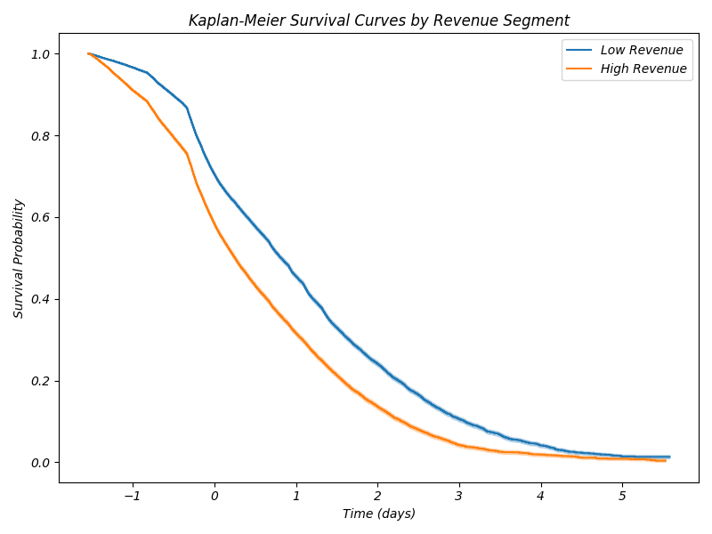
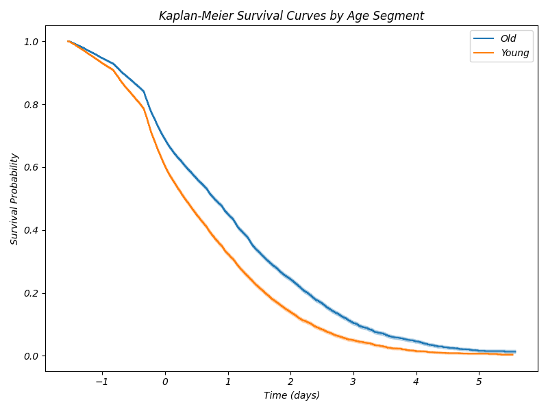
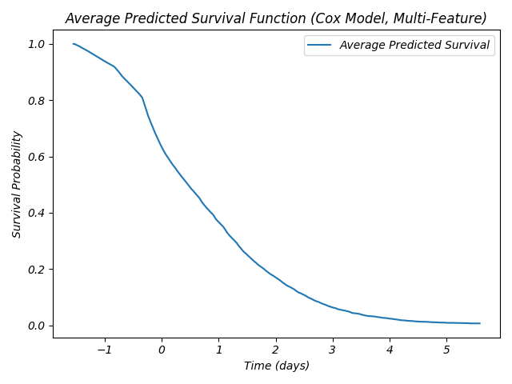
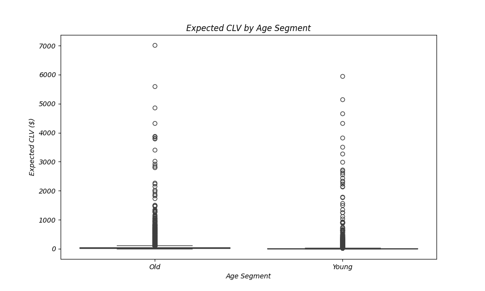
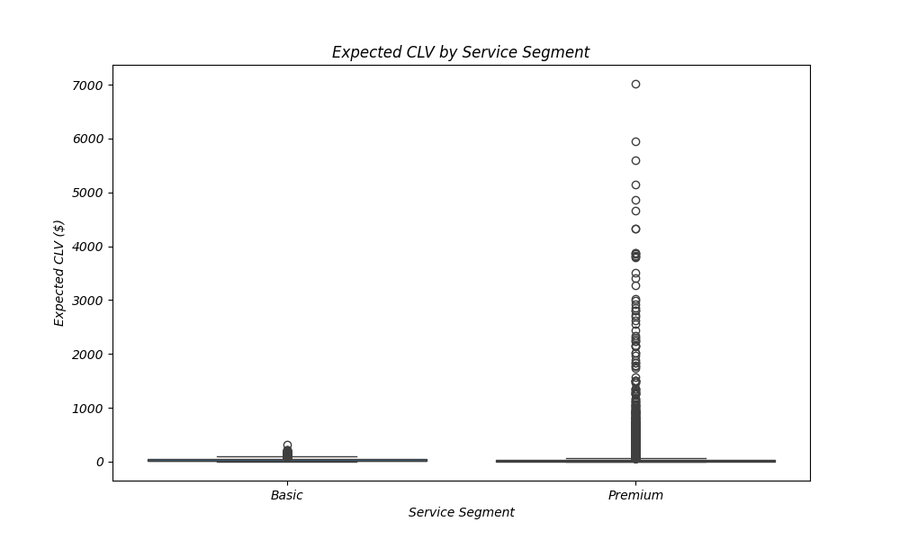
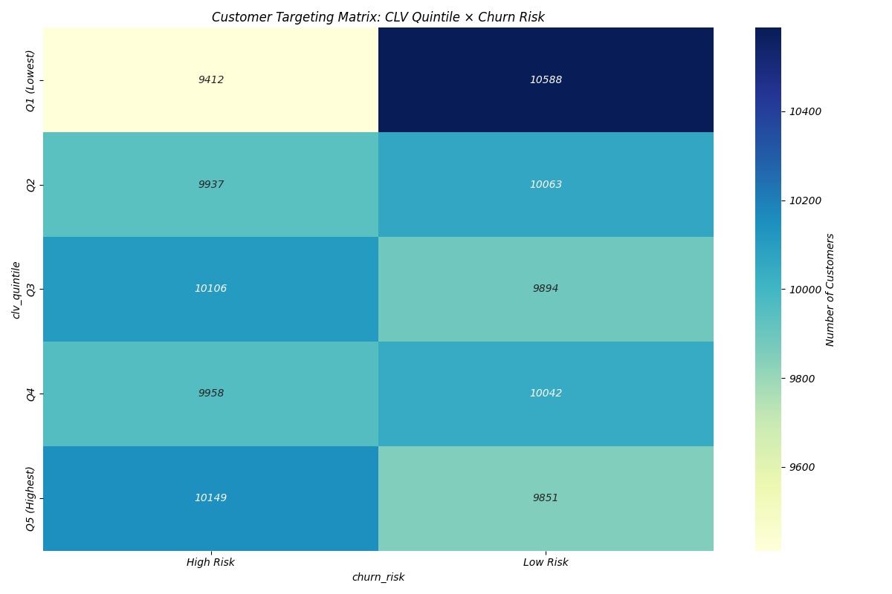
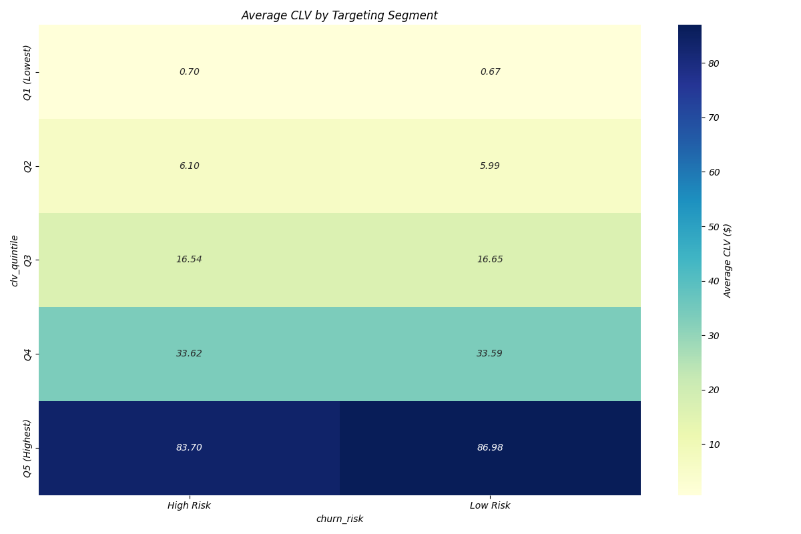
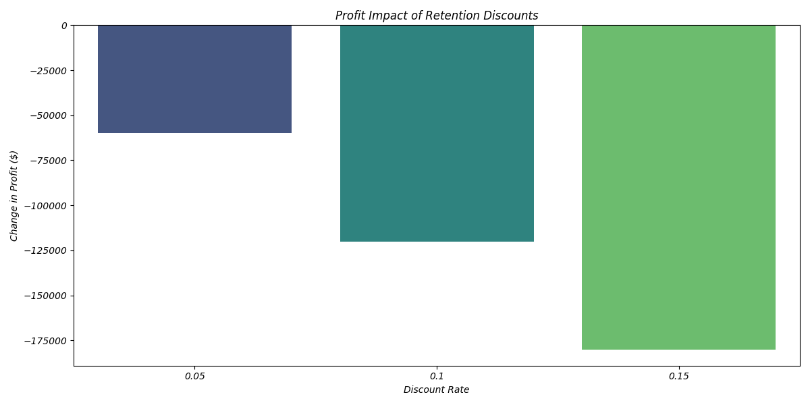
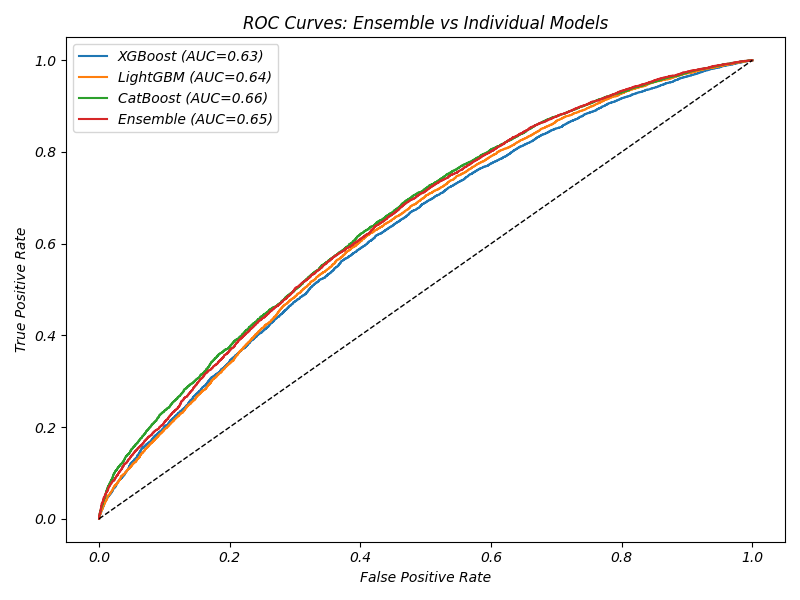

# Tables and Figures

## Table 1: Key Variables and Summary Statistics
| Variable | Description | Mean | Min | Max | Standard Deviation |
|----------|-------------|------|-----|-----|-------------------|
| MOU | Average monthly minutes of use | 615.7 | 0 | 3,360 | 498.2 |
| REV | Average monthly revenue | $53.64 | $0 | $223.07 | $21.36 |
| TOTCALLS | Average monthly total calls | 101.2 | 0 | 302 | 42.8 |
| CUSTCARE | Average monthly customer care calls | 0.38 | 0 | 11.3 | 0.74 |
| AGE | Age of primary account holder | 41.2 | 18 | 83 | 13.7 |
| EQPDAYS | Equipment days (age of device) | 405.8 | 0 | 999 | 221.3 |
| CHILDREN | Number of children in household | 0.8 | 0 | 5 | 1.2 |

## Table 2: Cox Proportional Hazards Model Summary
| Covariate | Coefficient | Exp(coef) | SE | p-value | Significance |
|-----------|-------------|-----------|------|---------|-------------|
| mou_Mean | 0.314 | 1.369 | 0.007 | <1e-99 | *** |
| age1 | -0.127 | 0.880 | 0.006 | <1e-96 | *** |
| drop_vce_Mean | 0.090 | 1.095 | 0.005 | <1e-76 | *** |
| totcalls | -0.167 | 0.846 | 0.007 | <1e-100 | *** |
| custcare_Mean | 0.023 | 1.023 | 0.002 | <1e-20 | *** |
| change_mou | -0.036 | 0.964 | 0.004 | <1e-16 | *** |
| rev_Mean | 0.011 | 1.011 | 0.005 | 0.053 | . |

## Table 3: CLV by Customer Segment
| Segment | Mean CLV | Median CLV | Count | % of Customer Base |
|---------|----------|------------|-------|-------------------|
| Old + Basic Service | $44.62 | $38.29 | 31,824 | 31.8% |
| Old + Premium Service | $40.72 | $22.46 | 19,824 | 19.8% |
| Young + Basic Service | $14.12 | $9.83 | 18,170 | 18.2% |
| Young + Premium Service | $12.11 | $3.67 | 30,182 | 30.2% |
| High Revenue | $25.00 | $8.05 | 50,181 | 50.2% |
| Low Revenue | $31.92 | $26.13 | 49,819 | 49.8% |

## Table 4: Pricing Optimization Results by Segment
| Segment | Fixed Fee | Variable Rate | Profit | % of Total Profit |
|---------|-----------|---------------|--------|-------------------|
| Q5 (Highest) \| High Risk | $200 | 0.50 | $1,928,471 | 10.1% |
| Q5 (Highest) \| Low Risk | $200 | 0.00 | $1,871,690 | 9.8% |
| Q4 \| High Risk | $200 | 0.00 | $1,892,020 | 9.9% |
| Q4 \| Low Risk | $200 | 0.00 | $1,907,980 | 10.0% |
| Q3 \| High Risk | $200 | 0.50 | $1,920,674 | 10.1% |
| Q3 \| Low Risk | $200 | 0.50 | $1,880,376 | 9.9% |
| Q2 \| High Risk | $200 | 0.50 | $1,889,418 | 9.9% |
| Q2 \| Low Risk | $200 | 0.50 | $1,913,541 | 10.1% |
| Q1 (Lowest) \| High Risk | $200 | 0.50 | $1,790,436 | 9.4% |
| Q1 (Lowest) \| Low Risk | $200 | 0.50 | $2,015,008 | 10.6% |
| **Total** | | | **$19,008,297** | **100%** |

## Table 5: Retention Discount Impact on Profit
| Discount Rate | New Variable Rate | Profit | Profit Change |
|---------------|-------------------|--------|---------------|
| 0% (Baseline) | 0.50 | $19,008,297 | - |
| 5% | 0.475 | $19,007,882 | -$415 |
| 10% | 0.45 | $19,007,467 | -$830 |
| 15% | 0.425 | $19,007,052 | -$1,244 |

## Figure 1: Kaplan-Meier Survival Curves by Revenue Segment

## Figure 2: Kaplan-Meier Survival Curves by Age Segment

## Figure 3: Kaplan-Meier Survival Curves by Service Segment

## Figure 4: Cox Predicted Survival Function

## Figure 5: CLV Distribution by Quintile

## Figure 6: CLV by Age Segment

## Figure 7: CLV by Service Segment

## Figure 8: Customer Targeting Matrix (Counts)

## Figure 9: Customer Targeting Matrix (Average CLV)

## Figure 10: Retention Discount Impact on Profit

## Figure 11: Model Comparison - Ensemble vs Individual Models

## Figure 12: Feature Importance in XGBoost Model
 